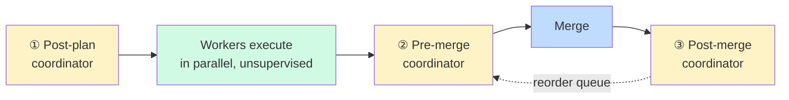

# Parallel Worktree Playbook — Build Multiple Fixes/Features Without Merge Hell

> Actionable version of the worktree + AI-agent parallel workflow. Use this when you have
> 2+ UI/UX fixes or features to land and want them all running at the same time without
> spending your week resolving conflicts. It contains: a pre-flight checklist, a registry
> file template, per-worktree plan templates, a coordinator-agent prompt, and a placeholder
> for your own task instructions.
>
> Companion docs: **[`playbook.md`](./playbook.md)** for plan quality (read first — every
> per-worktree plan must score ≥11/14 on its rubric), **[`workflow-diagrams.md`](./workflow-diagrams.md)**
> for the visual conventions this borrows.

---

## TL;DR (the one-screen version)

Parallel work fails for predictable reasons. The setups that **don't fail** share a small
set of properties:

1. **One worktree per fix.** No stash/checkout thrash. Each branch in its own dir, with its
   own dev server, its own agent session.
2. **Plans before branches.** Every worktree has an immutable plan file. Conflicts are
   detected in the plan stage, not the merge stage.
3. **A registry file is the source of truth.** `PARALLEL_WORK.md` — not an agent's memory —
   tracks what each worktree is doing.
4. **Coordinator is checkpoint-only, never full-time.** It runs at three discrete moments
   (post-plan, pre-merge, post-merge) and is inert between them.
5. **Short branches + `--ff-only` pulls + `--force-with-lease` rebases.** The mechanical
   rules that keep history linear and conflict surface small.
6. **One agent session per worktree.** Never shared. CWD pinned inside the worktree.
7. **Stop conditions per worktree.** When tests pass + plan steps all green + lint clean,
   the worktree is done — not when the agent "feels finished".

---

## Part 0 — Pre-flight checklist (before any worktree)

Answer all of these. If you can't, stop and resolve it.

| # | Question | Why it matters |
|---|---|---|
| 1 | Is the working tree on `main` clean? | Dirty trees pollute every worktree base. |
| 2 | Is local `main` caught up to `origin/main`? | A stale base = days of work on obsolete code. |
| 3 | Have all per-fix plans been written and reviewed? | Without plans, conflict detection is impossible. |
| 4 | Have you diffed the plans against each other for file overlap? | This is the single highest-leverage conflict-prevention move. |
| 5 | Is there a merge order decided for any overlapping plans? | Sequencing is cheaper than conflict resolution. |
| 6 | Does each plan have a `verify` per step (per [`playbook.md`](./playbook.md) §1)? | Plans without verify can't be checked red→green. |
| 7 | Do you have a terminal/tmux layout ready for N parallel agent sessions? | Booting agents ad-hoc leads to CWD/context confusion. |

### Commands to run, in order, every time

```bash
cd /Users/eldaru/Mubit/Minima/minima
git status                                       # MUST be clean
git checkout main
git fetch --prune
git pull --ff-only                               # never plain pull on main
```

Then proceed to Part 1.

---

## Part 1 — Plan first, branch second

The order is non-negotiable: **plan → registry → worktree**. Reversing it is how you get
merge hell.

### 1.1 — One plan file per fix

For each fix/feature, spin up an agent in **plan mode** and have it produce a plan file
following the template in [`playbook.md`](./playbook.md) Part 2. Store them in-repo so
reviewers see intent:

```
docs/BigPlan/plans/
├── shift-tab-mode.md
├── always-panel.md
└── delivery-badge.md
```

Each plan MUST declare:
- `files-mutated` — exact paths the agent will write to
- `files-read` — paths the agent will read for context
- `verify` per step — see [`playbook.md`](./playbook.md) §1

### 1.2 — Build the conflict matrix

Read all plans, lay them out in a grid, find overlaps before they become conflicts:

| File | shift-tab | always-panel | delivery-badge | verdict |
|---|---|---|---|---|
| `src/modes.ts` | modify | — | — | safe parallel |
| `src/panel.tsx` | — | modify | modify | **sequence** (delivery after panel) |
| `src/shortcuts.ts` | modify | modify | — | **sequence** (panel after shift-tab) |
| `tui_verify.sh` | add scenario | add scenario | add scenario | **sequence all three** |
| `tests/modes.test.ts` | modify | — | — | safe parallel |

**Verdict rules:**
- *safe parallel* — different files, run all at once.
- *sequence* — same file, land in order; later worktrees rebase after each earlier merge.
- *carve* — same file but disjoint regions (e.g., distinct functions). Partition by line
  range in each plan's `notes` field and parallelize.

### 1.3 — Write the registry (`PARALLEL_WORK.md`)

Commit it to `main`. This is the source of truth — not the coordinator agent's memory, not
a chat log. See Part 7 for the template.

---

## Part 2 — Create the worktrees

Conventional layout — worktrees as siblings of the main repo:

```
/Users/eldaru/Mubit/
├── Minima/                              # main worktree, stays on main
│   └── minima/                          # ← your repo root
├── minima-shifttab/                     # worktree 1
├── minima-panel/                        # worktree 2
└── minima-delivery/                     # worktree 3
```

**Always branch from `origin/main`, never local `main`:** this is the immunization against
the stale-base failure mode ([`playbook.md`](./playbook.md) Part 5 anti-pattern B is the
planning analog).

```bash
cd /Users/eldaru/Mubit/Minima/minima

# Pattern B (preferred) — branch directly off the freshest remote ref
git fetch origin
git worktree add ../../minima-shifttab   -b fix/shift-tab-mode    origin/main
git worktree add ../../minima-panel      -b feat/always-panel     origin/main
git worktree add ../../minima-delivery   -b fix/delivery-badge    origin/main

git worktree list                        # verify
```

### Gotchas

- **No `node_modules` sharing.** Each worktree needs its own install. Use `pnpm` for
  hardlinks from the global store (near-free), or `bun install` (this repo uses Bun per
  `packages/tui/`). Never symlink `node_modules` across trees.
- **`.env` files aren't shared.** Copy per worktree.
- **Never `rm -rf` a worktree.** Always `git worktree remove <path>` so metadata cleans up.
- **Submodules** have incomplete worktree support — test one worktree first if applicable.

---

## Part 3 — Per-worktree execution

### 3.1 — Install and boot

```bash
cd ../../minima-shifttab
bun install                             # or pnpm install / uv sync — match the worktree's stack
bun run dev                             # own dev server, own port
```

If you'll have multiple dev servers up, give each its own port:

```bash
PORT=3001 bun run dev                   # shifttab
PORT=3002 bun run dev                   # panel
PORT=3003 bun run dev                   # delivery
```

### 3.2 — Launch one agent session per worktree

Open N terminal windows (or tmux panes), one per worktree. **Launch the agent from inside
the worktree dir** so its CWD pins the scope:

```bash
# Terminal 1
cd /Users/eldaru/Mubit/minima-shifttab
opencode                               # or: claude, cursor, codex, etc.
```

**Rules for agent parallelism (non-optional):**

| Rule | Why |
|---|---|
| One session per worktree. | Shared sessions bleed context across features. |
| Launch from inside the worktree. | Pins file operations to the right tree. |
| Pass the plan file as the first instruction. | "Execute `docs/BigPlan/plans/shift-tab-mode.md`. Do not deviate. Report when done." |
| No cross-worktree reads. | Unmerged sibling code is not yet reality. |
| Lock shared files sequentially. | If `tui_verify.sh` is touched by 3 plans, only one agent edits it at a time. |
| Stop conditions are explicit. | "Done" = all plan steps green + `verify` passes + lint clean. |

### 3.3 — The worker agent's lifecycle

```
agent starts
  → reads PARALLEL_WORK.md (finds own section)
  → reads own plan file
  → reads .parallel/decisions.log (catches up on prior decisions)
  → for each step:
      → set_status(in_progress)            ← per workflow-diagrams.md
      → do the work
      → run verify command                  ← must go red→green
      → commit (small, scoped)
  → update PARALLEL_WORK.md status field
  → push draft PR
  → STOP, await coordinator's pre-merge checkpoint
```

---

## Part 4 — The coordinator agent (checkpoint-only)

The coordinator is **not a daemon**. It runs at three discrete moments. Between them, it
does not exist. This is the only design that avoids the orchestrator-agent trap (context
bloat, hallucinated state, drift into editing).



### Checkpoint 1 — Post-plan (before any worktree work starts)

Coordinator reads all plans, builds the conflict matrix, decides merge order, writes the
initial `PARALLEL_WORK.md`. Outputs: conflict matrix, merge order, list of "carve"
decisions for shared files.

### Checkpoint 2 — Pre-merge (per PR, before squash-merge)

Coordinator reads current `PARALLEL_WORK.md`, fetches latest, runs `git rebase --onto
origin/main` as a dry-run to detect conflicts, proposes resolution strategy. Outputs: per-PR
rebase instructions, conflict-resolution prompts for the worker agent if needed.

### Checkpoint 3 — Post-merge (after each PR lands)

Coordinator updates the registry, tells affected worktrees they need to rebase, reorders the
merge queue. Outputs: updated `PARALLEL_WORK.md`, list of worktrees now stale.

The coordinator prompt template is in Part 7.3.

---

## Part 5 — Merge order and the rebase dance

### 5.1 — Merge order rules

1. Smallest, least-conflicting PR first.
2. After each merge, every other affected worktree rebases onto the new `main`.
3. If two PRs conflict heavily, **stop parallel work** on them — land one, then rebase the
   other. Don't fight it.
4. Use squash-merge for clean per-PR commits (one commit per fix, easy to revert/bisect).

### 5.2 — The rebase (before every merge)

This is the literal anti-merge-hell move. Non-negotiable.

```bash
# inside the worktree whose PR is about to merge
git fetch origin
git rebase origin/main
```

If conflicts arise, **do not手工resolve blindly** — hand the conflict to an agent with the
intent of your branch:

```
I'm rebasing fix/shift-tab-mode onto origin/main. Both branches edited src/modes.ts.
My branch's intent: exit plan mode on Shift+Tab mid-stream should abort the in-flight turn.
Reconcile the conflict preserving that behavior. Do not weaken my tests.
```

Then:

```bash
git add <resolved-files>
git rebase --continue
git push --force-with-lease               # NEVER --force
```

`--force-with-lease` refuses to overwrite if someone else pushed in the meantime. `--force`
silently destroys their work. Always the lease.

---

## Part 6 — Cleanup

```bash
cd /Users/eldaru/Mubit/Minima/minima
git checkout main && git pull --ff-only

# Remove each worktree once its PR has merged
git worktree remove ../../minima-shifttab
git branch -d fix/shift-tab-mode
git push origin --delete fix/shift-tab-mode

# Periodic hygiene
git worktree prune                         # clean orphaned metadata
git worktree list                          # verify final state
```

Update `PARALLEL_WORK.md` to mark the worktree as `merged`. Remove its row from the active
section, archive to a `## Merged` section if you want history.

---

## Part 7 — File templates

### 7.1 — `PARALLEL_WORK.md` (registry, source of truth)

Commit this to `main` in the repo root.

```markdown
---
updated: <ISO timestamp>
---

# Parallel Work Registry

## Active worktrees

### worktree: minima-shifttab
- branch: fix/shift-tab-mode
- base: origin/main@<short-sha>
- owner: <who>
- plan: docs/BigPlan/plans/shift-tab-mode.md
- status: implementing | review | blocked | ready-to-merge
- files-mutated: [src/modes.ts, src/keymap.ts]
- files-read: [src/index.tsx]
- pr: #<num> (draft | open)
- blockers: none | <description>
- merge_order: 1

### worktree: minima-panel
- ...

## Conflict matrix

| File | shift-tab | panel | delivery | verdict |
|---|---|---|---|---|
| src/modes.ts | modify | — | — | safe parallel |
| ... | | | | |

## Merge order

1. #<num> (shift-tab) — smallest, no deps
2. #<num> (panel) — rebase after #1 (shares src/shortcuts.ts)
3. #<num> (delivery) — rebase after #2 (shares src/panel.tsx)

## Merged (history)
- (none yet)
```

### 7.2 — Per-worktree plan file (immutable after worktree creation)

Follow [`playbook.md`](./playbook.md) Part 2 for the YAML structure. Add one field:

```yaml
# Appended to the standard plan template
parallel:
  worktree: ../../minima-shifttab
  branch: fix/shift-tab-mode
  files_mutated: [src/modes.ts, src/keymap.ts]
  files_read: [src/index.tsx]
  shared_with_other_worktrees: []   # paths also touched by sibling plans
  merge_order: 1
```

**Immutability rule:** once the worktree exists, this file does not change. Scope changes
require a new plan + a noted supersession in `PARALLEL_WORK.md`.

### 7.3 — Coordinator agent prompt (save as `coordinator.md`)

```
You are the parallel-work coordinator. You do NOT edit code. You do NOT run continuously.

Your job at this checkpoint: [post-plan | pre-merge | post-merge]

Inputs you must read before deciding:
  1. PARALLEL_WORK.md
  2. All files in docs/BigPlan/plans/
  3. .parallel/decisions.log
  4. git fetch && git worktree list && gh pr list

Outputs you must produce:
  - Conflict matrix (files × branches)
  - Recommended merge order with rationale
  - Per-worktree blockers
  - For pre-merge: rebase dry-run results + conflict-resolution prompts

Then:
  - Append your decisions to .parallel/decisions.log
  - Update PARALLEL_WORK.md
  - Stop. Do not supervise workers.

Hard rules:
  - Never edit files outside PARALLEL_WORK.md and .parallel/decisions.log.
  - Never run git push, git rebase (without --interactive dry-run), or gh pr merge.
  - If you can't decide, say so and ask — don't fabricate state.
```

---

## Part 8 — 🟥 YOUR AGENT INSTRUCTIONS

> Replace this block with the actual prompts/tasks you want each worker agent to execute.
> Suggested structure: one task per worktree, with CWD, plan file, stop conditions, and
> escalation triggers. Keep each task self-contained — workers don't see each other.

<!-- AGENT_TASKS_START -->

### Task 1 — <worktree-name>

```yaml
worktree: /Users/eldaru/Mubit/minima-<name>
branch: <fix/feature-name>
plan: docs/BigPlan/plans/<plan>.md
merge_order: <int>
stop_when: <observable condition — e.g. "all plan steps green + bun test passes + ruff clean">
escalate_if: <condition — e.g. "verify fails twice in a row" | "rebase conflict on src/X.ts">
```

**Prompt to agent:**

> <replace this line with the actual instruction. Suggested opening:
> "Execute the plan at `docs/BigPlan/plans/<plan>.md`. Don't deviate. Run the `verify`
> command for each step before marking it done. Commit small and often. Push a draft PR
> when all steps are green. Update the status field in PARALLEL_WORK.md before stopping.
> Stop conditions: <from above>. Escalate to me if: <from above>.">

### Task 2 — <worktree-name>

```yaml
worktree: /Users/eldaru/Mubit/minima-<name>
branch: <fix/feature-name>
plan: docs/BigPlan/plans/<plan>.md
merge_order: <int>
stop_when: <observable condition>
escalate_if: <condition>
```

**Prompt to agent:**

> <replace>

### Task 3 — <worktree-name>

<!-- ... add as many as needed ... -->

<!-- AGENT_TASKS_END -->

---

## Appendix A — Pitfalls and fixes

| Pitfall | Cause | Fix |
|---|---|---|
| Merge hell | Long-lived branches | Cap branch lifetime at 1–2 days |
| Conflicts on shared file | Two plans touch same file | Sequence them; carve boundaries in plan stage |
| Stale `main` base | Forgot to fetch/pull | Always `git fetch` + branch off `origin/main` |
| Broken `node_modules` | Symlinked across worktrees | Fresh `bun install` per worktree |
| Orphaned worktrees | Manual `rm -rf` | `git worktree remove` |
| Force-pushed over teammate | Used `--force` | `--force-with-lease` always |
| Agent edits wrong tree | Shared session | One agent per worktree, launched from inside |
| Submodule breakage | Worktree + submodule combo | Avoid; or test carefully |
| Lost work in main worktree | Left dirty overnight | Commit or stash before context switch |
| Plan drift mid-flight | Worker deviates from plan | Pin plan file; review diff before each commit |
| Coordinator context bloat | Running it as a daemon | Checkpoint-only — read files, decide, stop |
| Registry rot | Nobody updates `PARALLEL_WORK.md` | Workers update own row on every status change |

---

## Appendix B — File layout

```
minima/                                   # main worktree
├── PARALLEL_WORK.md                      # registry, source of truth
├── .parallel/
│   ├── decisions.log                     # append-only coordinator log
│   └── coordinator-notes.md
├── docs/BigPlan/
│   ├── parallel-worktree-playbook.md     # this file
│   ├── coordinator.md                    # the coordinator prompt (Part 7.3)
│   └── plans/
│       ├── shift-tab-mode.md             # immutable per-worktree plans
│       ├── always-panel.md
│       └── delivery-badge.md
└── scripts/
    └── status.sh                         # auto-generates status from git/gh state
```

`scripts/status.sh` (suggested):

```bash
#!/usr/bin/env bash
set -euo pipefail
echo "# Parallel Work Status — $(date -u +%FT%TZ)"
echo
git worktree list
echo
gh pr list --draft --state open --json number,title,headRefName,mergeable \
  --template '{{range .}}- #{{.number}} {{.title}} ({{.headRefName}}) — mergeable: {{.mergeable}}{{"\n"}}{{end}}'
```

Run `scripts/status.sh` whenever you want a snapshot — no agent required.

---

## How this connects to the rest of BigPlan

This playbook is the **parallel-execution layer on top of [`playbook.md`](./playbook.md)**:
each per-worktree plan must independently satisfy the 7 properties, and the workflow here
assures they don't collide. The coordinator at Checkpoint 1 is essentially running
[`playbook.md`](./playbook.md)'s Part 3 per-step checklist across all plans at once.

If you change the parallel workflow, re-read [`playbook.md`](./playbook.md) §1 (verifiable
steps) and §4 (persistence/visibility) first — `PARALLEL_WORK.md` is what makes parallel
plans visible enough to course-correct.
