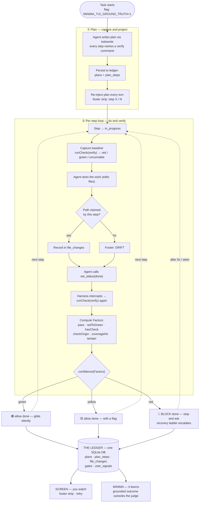
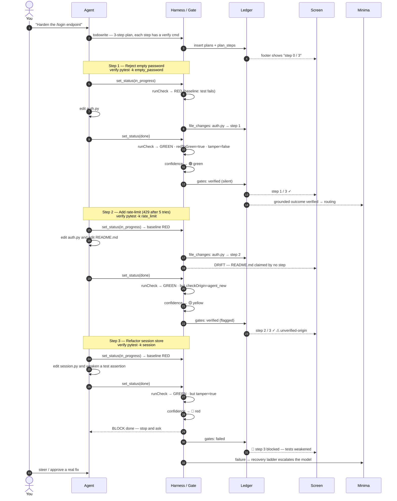

# Big Plan — Workflow Diagrams

> How the **Big Plan** (Ground-Truth Core) loop actually runs: the agent writes a plan,
> does the work, and **the harness checks each step really happened before letting it move on.**
> Every verdict lands in one small SQLite **ledger** that two readers consume — the **screen**
> (so you can watch) and **Minima** (so it learns which model actually succeeded).
>
> Design source of truth: [`docs/PLAN/ground-truth-plan.md`](../PLAN/ground-truth-plan.md) ·
> Everything here is behind the flag `MINIMA_TUI_GROUND_TRUTH` (off by default).

---

## The one-sentence model

> A plan step is only **done** when its own `verify` command goes **red → green because of
> this step's code** — and a confidence tier (🟢 / 🟡 / 🔴) decides whether the agent glides on
> silently, glides with a flag, or stops and asks.

### Reading key

| Symbol | Meaning |
|---|---|
| 🟢 **green** | Verified. Agent marks the step done and **glides on silently**. |
| 🟡 **yellow** | Went green, but something is soft (no check, agent-authored check, unknown coverage). Done **with a flag**. |
| 🔴 **red** | Check failed **or** tampering detected. Done is **blocked** — stop and ask; the recovery ladder escalates. |
| **DRIFT** | A file was written that **no plan step claimed** — surfaced in the footer, not hidden. |
| **The ledger** | One SQLite DB: `plans` · `plan_steps` · `file_changes` · `gates` · `user_signals`. |

### The confidence factors (what the gate computes)

`pass` (check result) · `redToGreen` (was red, now green) · `hasCheck` (a writing step with no
check → 🟡) · `checkOrigin` (`pre_existing` / `agent_new` / `user`) · `coverageHit` · `tamper`
(tests weakened or deleted → forces 🔴).

---

## Diagram 1 — General workflow

The reusable loop. It runs once per task, iterating the middle box once per plan step.



**How to read it, phase by phase:**

1. **Plan.** The agent emits a plan (`todowrite`); each step carries a `verify` command. The plan
   is written to the ledger and **re-injected into context every turn** so it survives scroll and
   compaction — the footer shows `step X / N`.
2. **Per-step loop.** When a step goes `in_progress`, the harness runs its check once to record a
   **baseline** (red / green / unrunnable). The agent works; every file write is **attributed to
   the step**, and any unclaimed write shows **DRIFT**. When the agent tries `set_status(done)`,
   the harness **intercepts**, re-runs the check, and computes the confidence **factors**.
3. **Tier → behavior.** 🟢 glides silently, 🟡 glides with a flag, 🔴 blocks and asks. Either way a
   `gates` row is written.
4. **Two readers.** The ledger feeds the **screen** (you watch; `/why` explains any step) and
   **Minima** (grounded outcomes flow into routing and **outrank the LLM judge**; failures
   escalate the model via the recovery ladder).

---

## Diagram 2 — Worked example

**Scenario:** *"Harden the `/login` endpoint."* The agent produces a 3-step plan. The run below
deliberately hits all three tiers — a clean pass (🟢), a soft pass (🟡), and a blocked step (🔴) —
plus a DRIFT event.



**Walking the example:**

| Step | Baseline | Work | Gate re-check | Factors that mattered | Tier | Outcome |
|---|---|---|---|---|---|---|
| **1 · Reject empty password** | 🔴 red (test fails) | edits `auth.py` | 🟢 green | `redToGreen=true`, `tamper=false` | 🟢 | Marked done **silently**; Minima logs a *verified* win for the model. |
| **2 · Add rate-limit** | 🔴 red | edits `auth.py` **+** `README.md` | 🟢 green | `checkOrigin=agent_new` (agent wrote its own check); `README.md` unclaimed → **DRIFT** | 🟡 | Done **with a flag** — went green, but the harness can't fully trust an agent-authored check, and it noticed off-plan work. |
| **3 · Refactor session store** | 🔴 red | edits `session.py` **+** weakens a test | 🟢 green | `tamper=true` (assertion removed) | 🔴 | **Blocked.** A green that came from gutting a test isn't a green. The agent stops and asks; Minima escalates. |

The lesson the example makes concrete: **the check passing is necessary but not sufficient.** Big
Plan asks *why* it passed — was it red first, who wrote the check, did the tests get weaker — and
only a step that survives all of that glides through untouched.

---

## Where this lives in the build

The loop is built bottom-up in stages (see [`ground-truth-plan.md`](../PLAN/ground-truth-plan.md) §3):

```
Stage 0  DB + flag           ─┐
Stage 1  persist the plan    ─┼──►  SEE the plan on screen (footer strip)   ← Diagram 1, phase ①
Stage 2  record file changes ─┘     ...and see DRIFT when work goes off-plan

Stage 3  the verify spec     ─┐
Stage 4  red→green gate       ─┼──►  a step can't be "done" unless a real check passes  ← Diagram 1, phase ②
Stage 5  provenance + tamper ─┘

Stage 6  confidence 🟢🟡🔴    ─────►  near-zero interruptions (only stops when it must)
Stage 7  feedback loop        ─────►  Minima learns from grounded outcomes   ← Diagram 1, "two readers"
Stage 8  /why + demo          ─────►  you can watch and replay the whole thing
```

Stages 0–2 make it **watchable**, 3–5 **verifiable**, 6 **quiet**, 7 **learns**, 8 **inspectable**.
