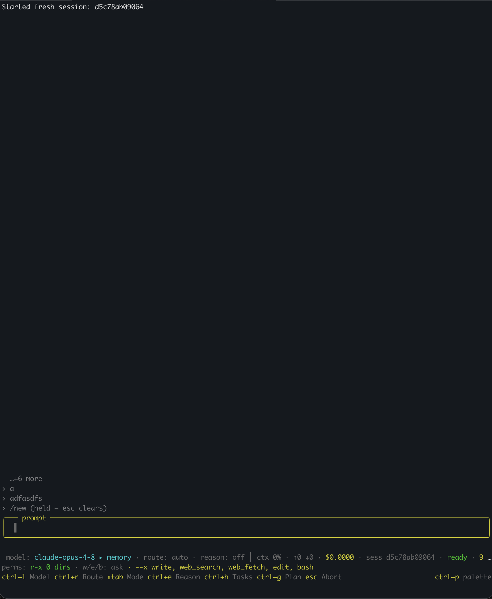

1. The queue that I canceled with Ctrl+C is still there after cancelation and after creating a new session with /new 
2. Also, sometimes the question box is vanishes because there is a clash of texts from the underneath of the prompt section.
